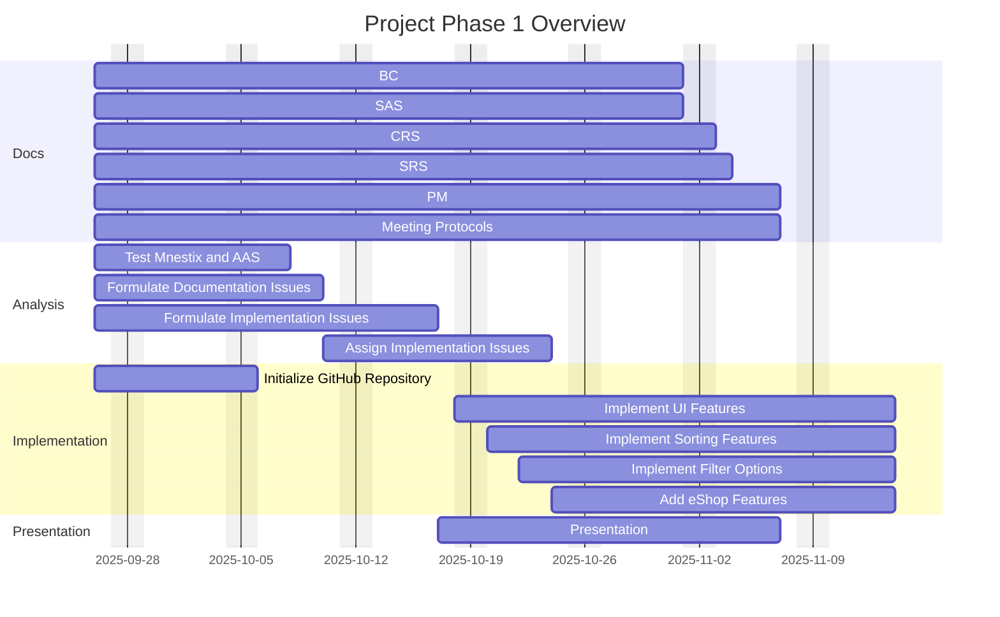
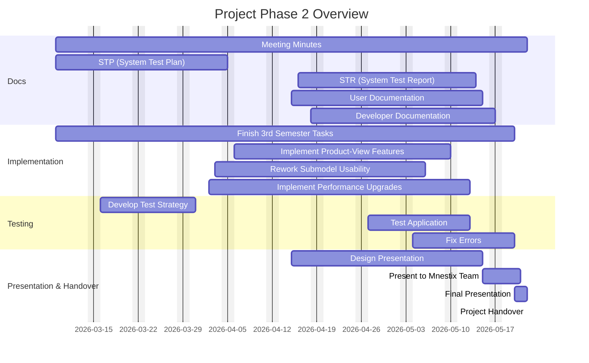
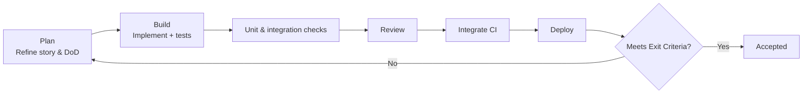

# Project Structure - Team 5 Mnestix Product Catalogue
| Author | Project | Course | Clients |
|:--------:|:-----------:|:---------------:|:--------:|
| Felix Hennerich | Mnestix Product Catalogue | TINF24F | Markus Rentschler, Pawel Wojcik

## Versions
| Version | Date       | Author         | Comment                                      |
|:--------:|:-----------:|:---------------:|:---------------------------------------------|
| 1.0 | 24.10.2025 | Felix Hennerich | Initialize document and structure|
| 1.1 | 31.10.2025 | Felix Hennerich | Project Init, Organisation Model, Risk Assessment, Gantt|
| 1.2 | 10.11.2025 | Felix Hennerich | Milestones and Deadlines, DoD |
| 1.3 | 11.11.2025 | Felix Hennerich | Added Implementation Phase chapter |

## Contents
- [Project Initialisation](#project-init)
- [Organisation Model](#org-model)
- [Milestones and Deadlines](#mile-dead)
- [Risk Management](#risk)
- [Gantt Chart](#gantt)
- [Implementation Phase](#implementation)
- [Definition of Done](#dod)

## Project Initialisation

### Key Activities

| Activity | Owner | Status | Date |
|:---------|:------|:-------|:-----|
| Role Assignment | PM | Complete | 26.09.2025 |
| Project Analysis | Team | Complete | 25.09.2025 |
| Project Selection | Team | Complete | 26.09.2025 |
| Tool Setup (GitHub, Mermaid, Markdown) | Tech Editors | Complete | 27.09.2025 |

### Resource Utilization

| Resource | Usage | Responsible |
|:---------|:------|:-----------|
| GitHub Repo | Code, Issues, CI | System Architect |
| Mermaid Live Editor | Gantt, Diagrams | Tech Editors |
| VS Code + Markdown All in One | Documentation | All |
| Discord | Communication | PM |
| Teams | Meetings | PM |
| Time | 180h per person total | - |

---

#### Project Selection Results

> **Selected Project:** Mnestix Product Catalogue  
> **Team:** Team 5  
> **Decision Date:** 26.09.2025

---

## Organisation Model

| Role | Name | E-mail | Matrikelnr |
|:--------:|:-----------:|:---------------:|:------:|
|Project Manager| Hennerich, Felix | ``inf24030@lehre.dhbw-stuttgart.de`` | 2594549 |
|Product Manager | Schumacher, Julian | ``inf24102@lehre.dhbw-stuttgart.de``| 4931903 |
|Test Manager| Schäffner, Nils | ``inf24109@lehre.dhbw-stuttgart.de``| 5152735 |
|Test Manager| Kruske, Jan| ``inf24027@lehre.dhbw-stuttgart.de`` | 1609477 |
|System Architect | Lange, Bruno| ``inf24077@lehre.dhbw-stuttgart.de`` | 4086963 |
|Technical Editor | Gottschewski, Gregor| ``inf24065@lehre.dhbw-stuttgart.de``| 3661830 |
|Technical Editor | Kelm, Robin | ``inf24243@lehre.dhbw-stuttgart.de`` | 9130160 |

---

## Milestones and Deadlines

### Project Timeline Overview

The Mnestix Product Catalogue project is structured in **two distinct phases** spanning across two academic semesters. The comprehensive timeline is visualized in the [Gantt Chart](#gantt) section below, providing detailed task scheduling and dependencies.

### Phase 1: Foundation & Initial Implementation
**Duration:** September 2025 - November 2025

#### Key Milestones

| Milestone | Target Date | Deliverables | Status |
|-----------|-------------|--------------|--------|
| **M1: Project Initialization** | 26.09.2025 | Team formation, role assignment, project selection |  Complete |
| **M2: Requirements Analysis** | 10.10.2025 | System analysis, issue formulation |  Complete |
| **M3: Documentation Baseline** | 01.11.2025 | BC, SAS, CRS completion | Complete |
| **M4: Phase 1 Presentation** | 07.11.2025 | Project status presentation | Complete |

#### Critical Deadlines
>- **SRS Delivery:** 04.11.2025
>- **Project Management Document:** 07.11.2025
>- **Feature Implementation:** 14.11.2025

---

### Phase 2: Enhancement & Finalization
**Duration:** March 2026 - May 2026

#### Key Milestones

| Milestone | Target Date | Deliverables | Status |
|-----------|-------------|--------------|--------|
| **M5: Testing Framework** | 31.03.2026 | System Test Plan (STP) completion |  Planned |
| **M6: Feature Enhancement** | 10.05.2026 | Product-view, performance upgrades | Planned |
| **M7: Quality Assurance** | 13.05.2026 | System Test Report (STR) | Planned |
| **M8: Documentation Finalization** | 17.05.2026 | User & developer documentation | Planned |
| **M9: Project Delivery** | 22.05.2026 | Final presentation & handover | Planned |

#### Critical Deadlines
- **Testing Phase Start:** 27.04.2026
- **Final Presentation:** 22.05.2026
- **Project Handover:** 22.05.2026

---

## Risk Management

> **Note:** This risk matrix represents the completed and comprehensive risk assessment for the project structure. The initial version created for the Business Case (BC) document was a first draft. This current version provides the complete risk analysis framework for the entire project structure.

### Risk Assessment Matrix

| Risk ID | Risk Description | Probability (1-5) | Impact (1-5) | Risk Score | Mitigation Strategy |
|---------|------------------|-------------------|--------------|------------|-------------------|
| R1 | Team member illness/unavailability | 3 | 4 | 12 | Cross-training, backup assignments |
| R2 | Technical complexity exceeds expertise | 4 | 4 | 16 | Early prototyping, mentor consultation |
| R3 | Scope creep from stakeholders | 2 | 3 | 6 | Clear requirements documentation |
| R4 | Integration issues with existing systems | 3 | 5 | 15 | Early integration testing, API documentation |
| R5 | Deadline conflicts with other courses | 4 | 3 | 12 | Time management, early planning |
| R6 | Key dependencies unavailable | 2 | 4 | 8 | Alternative solutions, backup plans |
| R7 | Hardware/infrastructure failures | 2 | 3 | 6 | Regular backups, cloud alternatives |
| R8 | Communication breakdown in team | 2 | 4 | 8 | Regular meetings, clear communication channels |

#### Risk Categories

**High Priority (Score ≥ 15):** R2, R4  
**Medium Priority (Score 10-14):** R1, R5  
**Low Priority (Score < 10):** R3, R6, R7, R8

#### Monitoring Plan
- Weekly risk assessment during team meetings
- Monthly review of mitigation strategies
- Immediate escalation for high-priority risks

### Risk Matrix Visualization

### PROJECT RISK MATRIX

<table align="center" style="border-collapse: collapse; width: 85%; margin: auto; border: 2px solid #34495e;">
<tr>
<th style="background-color: #34495e; color: white; padding: 12px; text-align: center; border: 1px solid #2c3e50; font-weight: bold;">IMPACT ↓ / PROBABILITY →</th>
<th style="background-color: #5a6c7d; color: white; padding: 12px; text-align: center; border: 1px solid #2c3e50; font-weight: bold;">1 LOW</th>
<th style="background-color: #5a6c7d; color: white; padding: 12px; text-align: center; border: 1px solid #2c3e50; font-weight: bold;">2</th>
<th style="background-color: #5a6c7d; color: white; padding: 12px; text-align: center; border: 1px solid #2c3e50; font-weight: bold;">3</th>
<th style="background-color: #5a6c7d; color: white; padding: 12px; text-align: center; border: 1px solid #2c3e50; font-weight: bold;">4</th>
<th style="background-color: #5a6c7d; color: white; padding: 12px; text-align: center; border: 1px solid #2c3e50; font-weight: bold;">5 HIGH</th>
</tr>
<tr>
<td style="background-color: #5a6c7d; color: white; padding: 12px; text-align: center; border: 1px solid #2c3e50; font-weight: bold;">5 HIGH</td>
<td style="background-color: #27ae60; color: white; padding: 18px; text-align: center; border: 1px solid #229954; font-weight: bold;">LOW</td>
<td style="background-color: #f39c12; color: white; padding: 18px; text-align: center; border: 1px solid #d68910; font-weight: bold;">MED</td>
<td style="background-color: #e67e22; color: white; padding: 18px; text-align: center; border: 1px solid #ca6f1e; font-weight: bold; font-size: 14px;">R4</td>
<td style="background-color: #e74c3c; color: white; padding: 18px; text-align: center; border: 1px solid #cb4335; font-weight: bold;">HIGH</td>
<td style="background-color: #a93226; color: white; padding: 18px; text-align: center; border: 1px solid #922b21; font-weight: bold;">CRIT</td>
</tr>
<tr>
<td style="background-color: #5a6c7d; color: white; padding: 12px; text-align: center; border: 1px solid #2c3e50; font-weight: bold;">4</td>
<td style="background-color: #27ae60; color: white; padding: 18px; text-align: center; border: 1px solid #229954; font-weight: bold;">LOW</td>
<td style="background-color: #f39c12; color: white; padding: 18px; text-align: center; border: 1px solid #d68910; font-weight: bold; font-size: 12px;">R6 R8</td>
<td style="background-color: #e67e22; color: white; padding: 18px; text-align: center; border: 1px solid #ca6f1e; font-weight: bold; font-size: 14px;">R1</td>
<td style="background-color: #e67e22; color: white; padding: 18px; text-align: center; border: 1px solid #ca6f1e; font-weight: bold; font-size: 14px;">R2</td>
<td style="background-color: #a93226; color: white; padding: 18px; text-align: center; border: 1px solid #922b21; font-weight: bold;">CRIT</td>
</tr>
<tr>
<td style="background-color: #5a6c7d; color: white; padding: 12px; text-align: center; border: 1px solid #2c3e50; font-weight: bold;">3</td>
<td style="background-color: #27ae60; color: white; padding: 18px; text-align: center; border: 1px solid #229954; font-weight: bold;">LOW</td>
<td style="background-color: #2ecc71; color: white; padding: 18px; text-align: center; border: 1px solid #28b463; font-weight: bold; font-size: 12px;">R3 R7</td>
<td style="background-color: #f39c12; color: white; padding: 18px; text-align: center; border: 1px solid #d68910; font-weight: bold;">MED</td>
<td style="background-color: #e67e22; color: white; padding: 18px; text-align: center; border: 1px solid #ca6f1e; font-weight: bold; font-size: 14px;">R5</td>
<td style="background-color: #e74c3c; color: white; padding: 18px; text-align: center; border: 1px solid #cb4335; font-weight: bold;">HIGH</td>
</tr>
<tr>
<td style="background-color: #5a6c7d; color: white; padding: 12px; text-align: center; border: 1px solid #2c3e50; font-weight: bold;">2</td>
<td style="background-color: #27ae60; color: white; padding: 18px; text-align: center; border: 1px solid #229954; font-weight: bold;">LOW</td>
<td style="background-color: #2ecc71; color: white; padding: 18px; text-align: center; border: 1px solid #28b463; font-weight: bold;">LOW</td>
<td style="background-color: #2ecc71; color: white; padding: 18px; text-align: center; border: 1px solid #28b463; font-weight: bold;">LOW</td>
<td style="background-color: #2ecc71; color: white; padding: 18px; text-align: center; border: 1px solid #28b463; font-weight: bold;">LOW</td>
<td style="background-color: #f39c12; color: white; padding: 18px; text-align: center; border: 1px solid #d68910; font-weight: bold;">MED</td>
</tr>
<tr>
<td style="background-color: #5a6c7d; color: white; padding: 12px; text-align: center; border: 1px solid #2c3e50; font-weight: bold;">1 LOW</td>
<td style="background-color: #27ae60; color: white; padding: 18px; text-align: center; border: 1px solid #229954; font-weight: bold;">LOW</td>
<td style="background-color: #2ecc71; color: white; padding: 18px; text-align: center; border: 1px solid #28b463; font-weight: bold;">LOW</td>
<td style="background-color: #2ecc71; color: white; padding: 18px; text-align: center; border: 1px solid #28b463; font-weight: bold;">LOW</td>
<td style="background-color: #2ecc71; color: white; padding: 18px; text-align: center; border: 1px solid #28b463; font-weight: bold;">LOW</td>
<td style="background-color: #f39c12; color: white; padding: 18px; text-align: center; border: 1px solid #d68910; font-weight: bold;">MED</td>
</tr>
</table>

---

## Gantt Chart

The following Gantt charts provide a comprehensive visual timeline of all project activities across both phases, showing task dependencies and resource allocation. These diagrams help track progress and ensure proper coordination between documentation, analysis, implementation, and testing activities.

#### Gantt 1st phase

#### Gantt 2nd phase

---

## Implementation Phase

Objectives
- Deliver tested, shippable increments aligned with milestones and the Definition of Done.

Preparation
- Approved design/SRS baselines; prioritized backlog with clear acceptance criteria.
- Ready environments, CI/CD, coding standards, and PR templates.

Process
- Iterations: 1–2 weeks; slice work into small, testable tasks.
- Branching & PRs: small feature branches, protected main; link issues; fast reviews.
- Quality: linters, static analysis, code review; feature flags for safe rollout.
- Collaboration: pair/mob for complex items; reuse components.

Task Workflow
1) Plan
2) Build
3) Verify
4) Review
5) Integrate
6) Stage

### Task Workflow Diagram

Testing
- Unit on critical modules; integration/API contracts; focused E2E for key flows; basic performance/security scans.

Exit Criteria
- Acceptance criteria met; tests pass; reviewed & merged; docs updated; staged successfully; rollback/flag ready.

---

## Definition of Done

Our team has established clear criteria for when tasks, features, or milestones are considered complete, ensuring consistent quality throughout the project.

### Development Standards

| Category | Requirements |
|----------|-------------|
| **Code Quality** | Documented code, peer-reviewed, follows naming conventions, no critical bugs |
| **Testing** | All tests pass, edge cases handled, integration verified |
| **Documentation** | User docs updated, API changes documented, setup instructions current |

### Review Process

**Team Approval:**
- Feature demonstration completed
- Feedback addressed by responsible team members
- Product Manager and System Architect sign-off

**Quality Gates:**
- Works in development environment
- Meets performance requirements
- Integrates properly with Mnestix system
- User experience is intuitive and responsive

### Deployment Readiness

- Clear deployment instructions available
- Rollback plan exists
- Stakeholder approval for major features

This Definition of Done ensures every deliverable meets our quality standards and project requirements.

---
