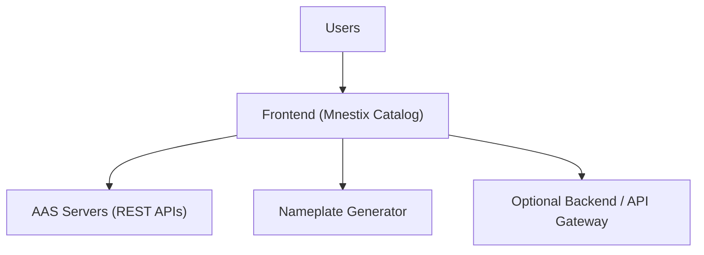

# Software Architecture Specification
 
**Author:** Bruno Lange  

**Date of last revision:** 08.11.2025  

---

## 1. Introduction

### 1.1 Purpose  
This SAS defines the architecture for enhancing the Mnestix Browser product catalog. It establishes system context, architectural structure, primary interfaces, constraints, and the rationale behind core decisions.

### 1.2 Scope  
**Included:** 
* repository configuration
* filtering/sorting
* lazy thumbnails
* Nameplate integration
* submodel rendering (BOM, TechnicalData, HandoverDocumentation)
* basic cart.  

**Excluded:** 
* payment features
* redesign of authentication
* AAS server implementation
* full rewrite of Mnestix core.

---

## 2. Stakeholders & Concerns

- **End users:** usable product navigation, clarity, responsiveness.  
- **Admins:** repository toggling, configuration transparency.  
- **Developers:** maintainability, modularity, testability.  
- **Integrators:** stable, uniform REST interactions.  
- **Lecturer/Community:** correctness, clarity, scope alignment.

Key concerns: performance, reliability, interoperability, scalability, maintainability.

---

## 3. Context & System Overview

### 3.1 System Context Diagram

**Architecture Style:** Client–server, REST/JSON, asynchronous data loading.  
**Data:** Distributed across multiple AAS servers; local browser persistence for preferences.

---

## 4. Goals & Constraints

### 4.1 Architectural Goals
The Mnestix browser UI should be improved on the aspects of usability and clarity for average users. Lazy loading of images and non-blocking loading of AAS-repositories should be achieved. Failures of some (not all) repositories will be handled gracefully and not consitute a crash or unclear behaviour on the clients side. The code structure should be held maintanable and modular.

### 4.2 Constraints
A short timeline and the existing Mnestix codebase can interfer with fast development, since the means for deeper change are not available. Payment integration for the shopping cart feature is subject to change, since the decision, which payment provider to use is a business (cost) driven decision and not about architecture. Therefore a consultation of Stakeholders on which payment providers to implement will be needed. 

---

## 5. Key Requirements

* Repositories can be enabled and disabled
* Item filtering
* Lazy-loaded images
* Product detail including Nameplate and submodels  
* Basic shopping cart functionality  

---

## 6. Architectural Decisions

### ADR Summary  
- **REST communication:** interoperability and statelessness.  
- **Async loading:** avoids UI blocking.  
- **Lazy loading:** reduces bandwidth and improves responsiveness.  
- **Modular architecture:** isolates responsibilities.  
- **Server-side filtering:** efficient handling of large data sets.  
- **Local browser storage:** simple persistence of non-sensitive data.

---

## 7. Architectural Views

### 7.1 Logical Architecture Diagram

```mermaid
graph LR
  subgraph UI[UI Layer]
    Header[Header / Login Status]
    RepoConfig[Repository Config]
    Catalog[Product List]
    Details[Product Detail]
    CartView[Cart]
  end

  subgraph Services[Service Layer]
    CatalogService
    FilterSortService
    RepositoryManager
    CartManager
    HttpClient["HTTP Client (Async)"]
  end

  subgraph Integrations[Integrations]
    NameplateGen[Nameplate Generator]
    AASAPI[AAS REST Endpoints]
  end

  UI --> Services
  Services --> Integrations
```

---

## 8. Interfaces

### 8.1 External Interfaces  
- `GET /shells` (filter/sort/pagination)  
- `GET /shells/{id}`  
- `GET /concept-descriptions`

### 8.2 Internal Services  
- CatalogService  
- FilterSortService  
- RepositoryManager  
- CartManager  

---

## 9. Quality Attributes  

**Performance:** <2s initial list load; lazy thumbnails.  
**Reliability:** tolerate aas repository failure.  
**Maintainability:** modular; testable service boundaries.  
**Security:** HTTPS, validated filters, no credentials stored locally.

---

## 10. Security  
If authentication is need, reusing the existing Mnestix Backend (proxy) is the simplest solution, since Keycloak OAuth2 is built in and already tested and used. In case a publice deployment is created, it should use TLS (https) encryption and not expose any irrelevant endpoints.

---

## 11. Testing & Operations  
- Automated testing for the web services
- Integration tests with mock AAS.
- Basic monitoring of AAS endpoint failures.
