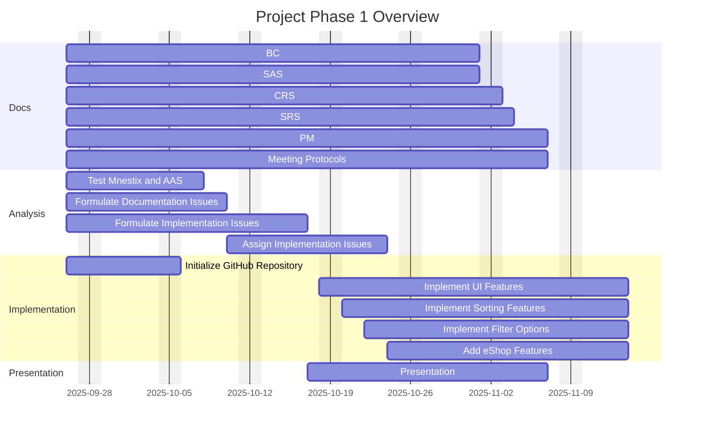
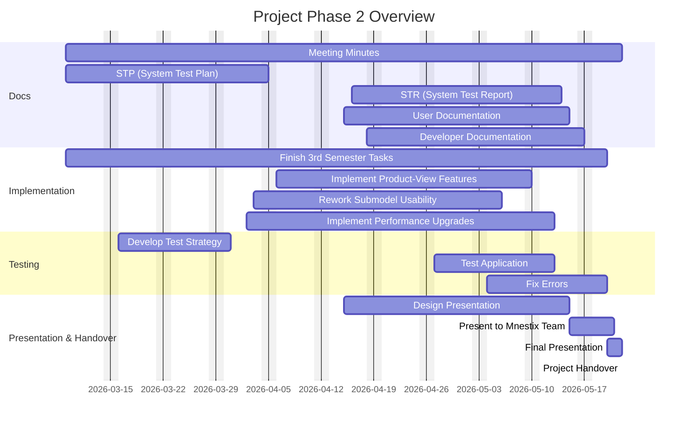
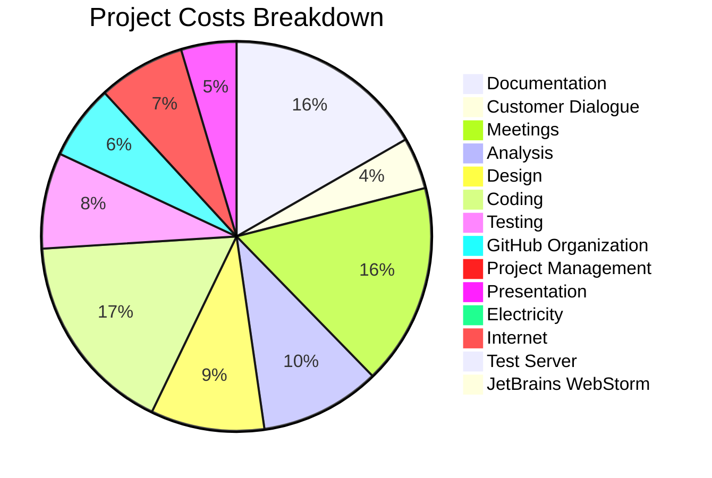

> [!CAUTION]
> This document is only for company use! Do not share with anybody, especially customers!
> Only grant insight to supervisors for grading!

<h1 align="center">Business Case</h1>
<h3 align="center"> Customer: Rentschler, Wojcik, XITASO</h3>
<h3 align="center"> Created by Nils Schäffner</h3>

| Version | Date       | Author         | Comment                                      |
|:--------:|:-----------:|:---------------:|:---------------------------------------------|
| 1.0 | 09.10.2025 | Nils Schäffner | Initialize BC and document structure          |
| 1.1  | 10.10.2025 | Nils Schäffner | Formulate Introduction, Scope and Benefits |
| 1.2 | 12.10.2025 | Nils Schäffner | Initialize BC as Markdown in GitHub Docs |
| 1.3 | 14.10.2025 | Nils Schäffner | Add Gantt diagram and risk analysis |
| 1.4 | 15.10.2025 | Nils Schäffner | Add cost and price calculation |
| 1.5 | 24.10.2025 | Nils Schäffner | Applied review suggestions and relocated the BC to PROJECT |

# TABLE OF CONTENTS
- [Introduction](#introduction)
- [Scope](#scope)
- [Qualitative and Quantitative Benefits of Development](#qualitative-and-quantitative-benefits-of-development)
- [Time Plan](#time-plan)
  - [Gantt Diagram 1st Phase](#gantt-1st-phase)
  - [Gantt Diagram 2nd Phase](#gantt-2nd-phase)
- [Risk Analysis](#risk-analysis)
  - [Risk Matrix](#risk-matrix)
- [Financial Aspects](#financial-aspects)
  - [Project Team Costs](#project-team-costs)
  - [Workload Distribution (hours per task, 180h per person)](#workload-distribution-hours-per-task-180h-per-person)
  - [Other Costs](#other-costs)
  - [Overview](#overview)
  - [Offer](#offer)

# Introduction

This document outlines the business case for the upcoming software project. The project team has successfully collaborated on multiple projects in the past, continuously developing strong web engineering expertise to deliver high-quality digital products.
In the following sections, the customer’s order will be presented in detail, with a particular focus on the value and benefits our solution will provide to the client. Furthermore, this document outlines the process that led to the customer cost offer. It includes a comprehensive time and risk analysis, followed by a detailed cost estimation required to successfully complete the project.

# Scope

Mnestix Product Catalogue is a web-based open-source software designed to simplify the implementation of the Asset Administration Shell (AAS). Its main purpose is to support the creation and management of digital product catalogues, offering various features for browsing and organizing catalogue data.
However, several important usability and functionality aspects are still missing from a user perspective. The planned improvements will mainly focus on enhancing the application’s usability and integrating additional services such as the Nameplate Generator. Furthermore, eShop functionalities (e.g., Add to Cart, Show Cart) will be introduced, and the presentation of documentation and technical data will be refined.
The project also aims to improve product search, filtering, and data visualization while ensuring smoother interaction with repositories. In addition, the team will analyze existing features, evaluate the current usability concept, and implement targeted improvements to increase overall efficiency and user satisfaction.
For detailed requirements see [SRS](https://github.com/DHBW-TINF24F/Team5-management-and-docs/blob/main/PROJECT/software-requirements-specification.md).

# Qualitative and quantitative benefits of development

The enhancement of the Mnestix Product Catalogue brings measurable functional and economic value by improving usability, efficiency, and interoperability within the AAS ecosystem.

| Qualitative Benefits |
|:---------------------|
| Improved Usability and User Experience
A clearer interface, faster navigation, and better data presentation reduce user effort and increase acceptance. |
| Enhanced Integration and Interoperability
Stronger AAS standard compliance enables smoother interaction with external systems and future extensions. |
| Higher Customer Satisfaction
Added features such as the Nameplate Generator and eShop functionality expand the system’s usefulness and market appeal. |
| Knowledge and Community Value
The project strengthens the open-source Mnestix ecosystem and the team’s expertise in digital twin technologies. |

| Quantitative Benefits |
|:----------------------|
| Time Efficiency – Up to 10–20% faster product search and data operations through optimized loading and filtering. |
| Lower Maintenance Costs – A more modular and documented codebase reduces long-term effort by 20–25%. |
| Improved Data Quality – More consistent repository handling reduces input errors by around 15–20%. |
| Future Scalability – A unified architecture supports cost-effective integration of future modules and services. |

#### Business Impact
Overall, the development increases productivity, reduces operational costs, and strengthens Mnestix’s position as a modern, user-friendly platform for AAS-based product catalogue management.

# Time plan

The project starts at 19th September 2025 and will end in May 2026. The project is divided in two parts.
The first phase starts at 19th September 2025 and ends with the 30th November 2025. The second phase starts at 9th March 2026 and ends in May 2026.
To use the teams time effectively a structured plan is needed.
This plan is provided in the two following gantt diagrams, which display every task in detail:

### Gantt 1st phase

### Gantt 2nd phase

# Risk Analysis

To grant a smooth and secure development we need to assess possible risks in order to develop counter measures

## Risk Matrix
We evaluate every risk with probability and impact to create a handy overview to see the most dangerous risks on first sight:

| Impact → / Probability ↓  | 1 (Low) | 2 | 3 | 4 | 5 (High) |
|---------------------------|:-------:|:--:|:--:|:--:|:---------:|
| 1 (Very Low)             | Customer Changes 🔹 Unrealistic Customer Requests 🔹 | Declining Motivation 🔹 | Communication Problems 🔹 | - | - |
| 2 (Low)                  | - | Too Many Features 🔸 | Documentation Failures 🔸 Complicated Testability 🔸 | Temporary Staff Absence 🔸 Difficult Re-Entry 🔸 | Permanent Staff Loss 🔸 |
| 3 (Medium)               | Hardware Failure 🔹 | Conflicts w/ Existing Software 🔸 | Lack of Testing 🔺 | Handover Errors to Mnestix 🔺 | - |
| 4 (High)                 | - | Time Shortage 🔸 | - | - | Overload / Task Overcommitment 🔺 |
| 5 (Very High)            | - | - | - | - | - |

**Legend:**  
🔹 = Low Risk 🔸 = Medium Risk 🔺 = High Risk

# Financial aspects

Working on the Mnestix Browser enhancement creates numerous costs for the company.
Seven employees make up the team that is required for this task. Every member brings unique skills and is specialized in another, so they serve in different roles during the project.
During the 9 months every member is supposed to serve about 180 hours of worktime on the project.
According to their following wages, the personnel costs are:

### Project Team Costs 

| Name                     | Role                | Hourly Rate (€) | Hours | Cost (€) |
|--------------------------|-------------------|----------------|-------|-----------|
| Felix Hennerich          | Project Manager     | 71.50          | 180   | 12,870    |
| Julian Schumacher        | Product Manager     | 64.75          | 180   | 11,655    |
| Bruno Lange              | System Architect    | 78.20          | 180   | 14,076    |
| Nils Schäffner           | Test Manager        | 59.80          | 180   | 10,764    |
| Jan Kruske               | Developer           | 44.60          | 180   | 8,028     |
| Robin Kelm               | Technical Writer    | 48.90          | 180   | 8,802     |
| Gregor Gottschewski      | Technical Writer    | 55.10          | 180   | 9,918     |
| **Total**                |                     |                |       | **75,113** |

### Workload Distribution (hours per task, 180h per person)

To structure the tasks and use everyone's most developed skills we provided a detailed time plan on how everyone will spend their time on the project.

| Task                 | Felix Hennerich | Julian Schumacher | Bruno Lange | Nils Schäffner | Jan Kruske | Robin Kelm | Gregor Gottschewski |
|----------------------|----------------|-----------------|------------|----------------|-----------|------------|-------------------|
| Documentation        | 30             | 30              | 30         | 30             | 30        | 30         | 30                |
| Customer Dialogue    | 15              | 15               | 5          | 5              | 0        | 5          | 5                 |
| Meetings             | 30             | 30              | 30         | 30             | 30        | 30         | 30                |
| Analysis             | 5             | 25              | 30         | 5             | 20        | 20         | 20                |
| Design               | 0              | 15              | 50         | 20             | 0         | 10          | 20                 |
| Coding               | 10             | 40              | 20         | 20             | 65        | 50          | 25                 |
| Testing              | 5             | 0               | 5         | 60              | 15        | 10          | 10                 |
| GitHub Organization  | 15              | 5               | 5          | 5             | 5         | 15         | 25                 |
| Project Management   | 60              | 10               | 0          | 0              | 0         | 0          | 10                |
| Presentation         | 10             | 10              | 5         | 5             | 15        | 10         | 5                |
| **Total**            | 180            | 180             | 180        | 180            | 180       | 180        | 180               |

### Other costs

In addition to the personnel costs other things are required to fulfill the job accordingly.
These are:

| Expense                 | Amount (€)      |
|-------------------------|----------------|
| Electricity             | 350.65         |
| Internet                | 325.75         |
| JetBrains WebStorm  | 19.90 × 9 = 179.10 |
| Test Server             | 205.56         |
| **Total**               | 1,061.06       |

### Overview

To provide a detail overview what money is spent on the costs are displayed in this pie chart.
Since every aspect is displayed individually we can analyse where we can save money in the next project.

### Offer

Making up an offer wasn't easy for the team. On the one hand we had to find the balance between creating enough profit to invest in the company's growth. 
On the other hand Mnestix is an important customer and we do not want to lose them with an offer that is way too high.
In the end we decided on a profit rate of **25%**.
In addition we demand 5% of the total offer price annually to keep our service running and provide minor fixes and updates. Demands with larger scale will provide a separate offer again.

### Overview

| **Cost Type**        | **Amount (€)**  |
|:----------------------|---------------:|
| Personnel Costs       | 75,113.00      |
| Other Costs           | 1,061.06       |
| **Subtotal**          | —              |
| Markup (×1.25)        | —              |
| **Total Project Cost**| **95,217.58**  |
| In Addition (per year)| 4,760.88       |
