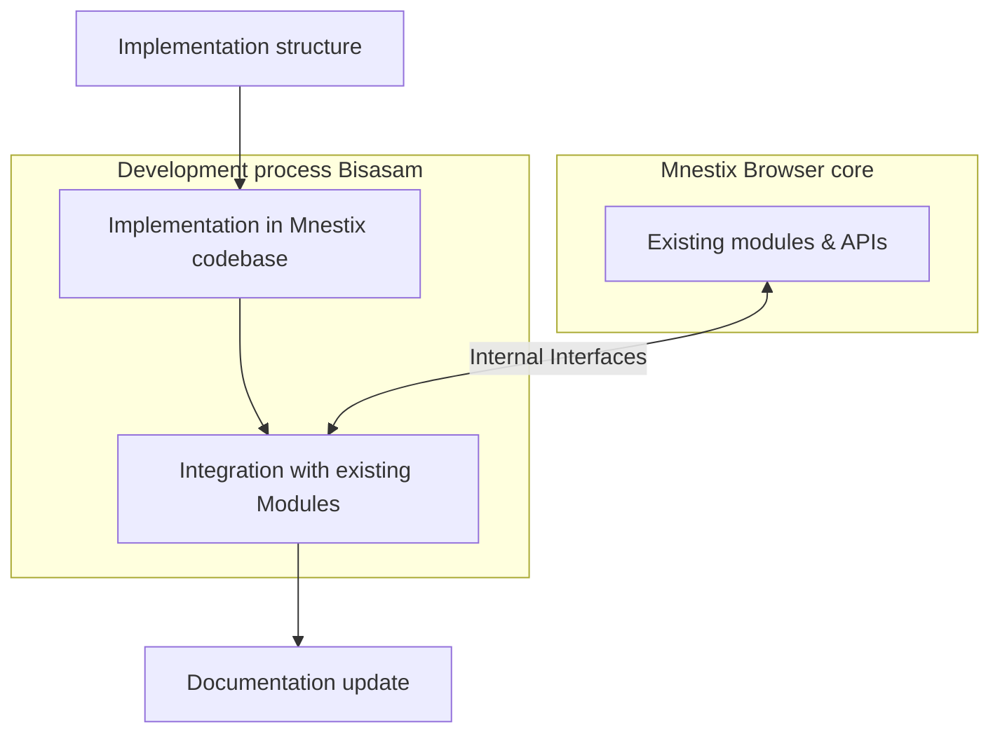
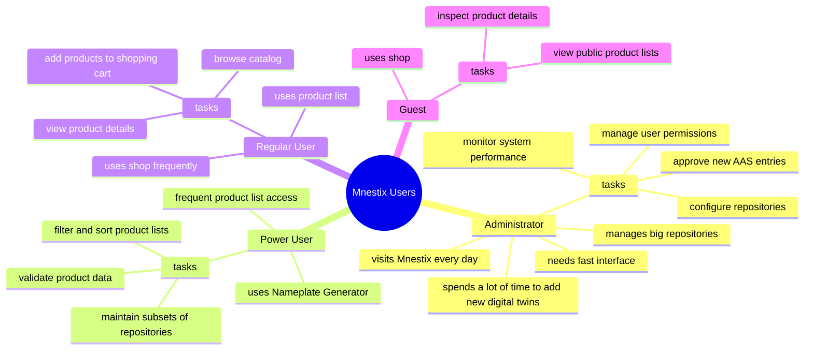

# Software Requirements Specification

This Software Requirements Specification (SRS) specifies the work of group 5.
The software and this secification was developed in connection with a university project.

**Author:** Gregor Gottschewski

**Date of last revision:** 26.09.2025

> Read the [IEEE Guide to Software Requirements Specifications](https://ieeexplore.ieee.org/stamp/stamp.jsp?tp=&arnumber=278253) or [IEEE Recommended Practice for Software Requirements Specifications](https://ieeexplore.ieee.org/stamp/stamp.jsp?tp=&arnumber=720574) before contributing to the SRS.

## Introduction

### Purpose

The purpose of this document is to define user interface extensions for the Mnestix Browser.

The following specification is written for the developer team and the customer.
Secondary readers include computer science students.  
Required for reading this specification is knowledge about the Mnestix Browser and its current features (as of 2025-10-03).

### Definitions and Acronyms

**_SRS_** is the acronym for Software Requirements Specification.  
**_The software_** refers to all software parts specified here.  
**_The developer team_** includes all developers and organizations listed [here](index#software-requirements-specification).  
**_Extensions_** are further developments of the already existing code base of the Mnestix Browser if not stated further.  
**_The customer_** is the supervising lecturer.  
**_UI_** is an acronym for user interface.  
**_Mnestix_** is a short form of Mnestix Browser.  
**_Power users_** are software users that spend a long time using the software.  
**_Regular users_** are software users that use the software sometimes.  
**_Guest_** is a user that is not registered at the Mnestix Browser instance.  
**_Product_** is a synonym for AAS.

This specification uses terms 'modern hardware' and 'stable connection to the backend' often.
The software was tested on a MacBook Pro 2024 (M4 Pro, 48 GB, macOS 15.7.1) with a local Mnestix Browser build.
All loading times etc. refer to this machine and environment.
Note that the repository size influences the loading time.
This software was tested with a 100 item repository.

### Scope

The name of the product specified here is _Project Bisasam_.
Project Bisasam refers only to the extensions specified later.
The name Mnestix is not affected and stays.

Project Bisasam extends the usability and functionality of Mnestix' catalogue feature.
These extensions affect the catalogue/repository dashboard, the product list, the product view and the menu bar.
Project Bisasam covers only the UI extensions specified in this SRS. It does not affect the Mnestix core system.
All changes strictly refer to the UI.

The goal of project Bisasam is to add additional UI features to increase the Mnestix user experience.

### References

* Features requests where made by our supervising lecturer and can be found at the [DHBW-TINF24F GitHub Organization (root/project-5)](https://github.com/DHBW-TINF24F/.github/blob/main/project5_mnestix_product_catalogue.md)
* The structure of this SRS follows the [ISO/IEC/IEEE 29148:2018 standard](https://ieeexplore.ieee.org/document/8559686)
* Information about Mnestix Browser can be found on [Mnestix-Browser GitHub](https://github.com/eclipse-mnestix/mnestix-browser)
* Requirements table follows [ISO/IEC/IEEE 29148 standard](https://ieeexplore.ieee.org/document/8559686)

### Overview

This SRS does not strictly follow ISO/IEC/IEEE standard 29148:2018.
Some parts of this SRS follow the older standard IEEE 830-1984 because [TODO: but why?]

## Overall description

### Product perspective

Project Bisasam extends the product catalog functionality of the [Mnestix Browser](https://github.com/eclipse-mnestix/mnestix-browser/).
The Mnestix Browser simplifies the implementation and visualization of the Asset Administration Shell (AAS).
The new features are implemented by direct modifications to the Mnestix code base.
All interfaces are integrated with existing Mnestix modules.

#### System interfaces

Communication between Mnestix Browser and Project Bisasam is handled internally.
These APIs are developed by the Mnestix developer team.
Bisasam uses the existing Next.js and TypeScript framework (like Mnestix itself) and does not modify the application architecture.
Project Bisasam requires no other services.

The new feature implementations follow a strict structure:

#### User interfaces

Bisasam enhances catalog management, repository configuration, and product visualization.  
All new UI elements are integrated into the existing Mnestix UI.

Users interact with project Bisasam's extension on all views.
Some extensions affect the repository configuration view and the catalog selection view.
The product view, responsible for listing all products, and the product detail view are part of project Bisasam's extensions.
These changes do not affect Mnestix' UI principles.

These changes follow Mnestix’s existing design principles.
All affected elements are configurable and/or selectable by the user.

#### Operations

Project Bisasam does not change administration behaviour.
Some new features add additional log messages to provide information.
These log messages are not specified and will only be added if necessarily need for development or administration.

### Product functions

The software adds new UI elements and features stated in section [User interfaces](#user-interfaces).
The following content adds additional, non UI-features, and refers to user interfaces.

To increase Mnestix Browser's performance, the code base of the product list should be improved.
Thumbnails should only load on the user's visible screen.
Additionally to performance improvements, the user experience should be increased.
These new features cover filtering, sorting and detailed product information.
Some features do not enhance existing features but add new features.
Part of this are eShop interactions and integration of an external nameplate generator.

### User characteristics

Mnestix Browser and the corresponding project Bisasam user group is diverse.

Four types of users uses Mnestix Browser: administrators, power users, regular users and guests.
All user groups benefit from project Bisasam's new features.
However, the focus should be the regular and power users as well as the administrator.
These user groups need fast and reliable features.

The cart and shop feature is the most critical part of project Bisasam.
It has to be acessable for every user group and should bring all relevant information about the selected products.

> See [limitations](#limitations) for more information about the shop.
> Project Bisasam assumes that guests are called upon to register before buying a product.

Project Bisasam does not change Mnestix' user management nor user rules/rights.

### Limitations

Project Bisasam covers a shop function with a chart.
It does not implement money transaction or other interfaces to buy a product.

### Assumptions and dependencies

* No second Mnestix Browser version is running at the same time
* No modifications of the core Mnestix Browser are allowed
* The Mnestix Browser fork of project Bisasam is installed correctly

## Specific requirements

Project Bisasam should add following features to Mnestix Browser.

Verification methods:

* **Test:** Tested by running the system and with logic tests.
* **Demonstration:** Show feature in running system, requirement is visible to user.
* **Inspection:** Requirement can be checked with code analysis or UI-layout-analysis.
* **Load-Test:** Requirement can be tested on modern hardware with an automatic or manual load test.

| ID | Requirement Description | Priority | Rationale | Verification Method |
|----|--------------------------|-----------|------------|----------------------|
| **FR.001** | The system shall display a symbol in the upper-right corner of the menu bar that indicates the current login status of the user. | Required | Provides clear user feedback about authentication state. | Inspection |
| **FR.002** | The system should integrate all functions and menus of the existing login status button into the new login status symbol. | Optional | Simplifies user interface and centralizes login actions. | Demonstration |
| **FR.003** | The system shall display the number of AAS entries per repository in the repository view, next to the repository name. | Required | Improves repository transparency and usability. | Test |
| **FR.004** | The system shall provide access to the Nameplate Generator from the product context menu using the given implementation repository. | Required | Enables generation of digital nameplates directly from products. | Test |
| **FR.005** | The system shall display the columns `ManufacturerName`, `ProductDesignation`, `OrderCode`, `ManufacturerCode`, `GlobalAssetId`, and `CreatedAt` in the AAS list. | Required | Ensures consistent presentation of key AAS data. | Inspection |
| **FR.006** | The system shall allow users to filter the AAS list based on query parameters. | Required | Improves data navigation and usability. | Test |
| **FR.007** | The system shall allow users to sort the AAS list entries by any available column. | Required | Provides flexible and efficient data access. | Test |
| **FR.008** | The system shall provide a cart view accessible via the sidebar and under the path `/cart`. | Required | Central entry point for shopping workflow. | Test |
| **FR.009** | The system shall list all products added to the cart in the cart view. | Required | Ensures cart transparency and user awareness. | Test |
| **FR.010** | The system shall allow users to edit product quantities within the cart view. | Required | Supports quantity management before checkout. | Test |
| **FR.011** | Each product view shall contain an “Add to cart” button allowing the user to add the product to the cart. | Required | Enables product selection workflow. | Test |
| **FR.012** | The sidebar shall display the total number of products currently in the cart. | Required | Provides quick cart overview. | Inspection |
| **FR.013** | The system should allow enabling or disabling the shop functionality through an environment variable in the `.env` file. | Optional | Allows deployment flexibility. | Inspection |
| **FR.014** | The system should support integration with an external payment provider. | Optional | Enables online payment features. | Demonstration |
| **FR.015** | The system should display a price for each product when the shop module is enabled. | Optional | Increases product transparency for users. | Inspection |
| **FR.016** | The system shall allow users to enable or disable individual AAS repositories within the configuration dialog. | Required | Supports selective repository management. | Test |
| **FR.017** | The system shall allow users to configure CD repositories through the configuration dialog. | Required | Provides management of connected data repositories. | Test |
| **FR.018** | The system should allow users to inspect the contents of CD repositories through the user interface. | Optional | Enhances transparency of CD data. | Demonstration |
| **FR.019** | The system should improve the formatting of the `SM TechnicalData` submodel for better readability. | Optional | Enhances user understanding of technical data. | Inspection |
| **FR.020** | The system should improve the formatting of the `HandoverDocumentation` submodel for better readability. | Optional | Increases usability for document-related submodels. | Inspection |
| **FR.021** | The system should allow navigation through linked AAS references within submodel visualizations. | Optional | Enables seamless exploration of linked AAS data. | Demonstration |
| **FR.022** | The configuration dialog shall provide refined options for managing repositories, including CD repository configuration and activation control. | Required | Centralizes repository management and user control. | Test |

UNGENAUIGKEIT BEI Im Konfigurationsdialog sollen die Einstelloptionen verfeinert werden: CD-Repositories sollen konfiguriert werden können, Es soll eine inhaltliche Anzeige des/der CD-Repositories möglich sein., Die Anzeige des SM TechnicalData soll benutzerfreundlicher erfolgen.

### Non-Functional Requirements (NFR)

| ID | Requirement Description | Category | Rationale | Verification Method |
|----|--------------------------|-----------|------------|----------------------|
| **NFR.001** | The system shall load the AAS list with up to 100 entries in under 3 seconds. | Performance | Ensures responsive user experience. | Measurement |
| **NFR.002** | The system shall support concurrent access by at least 10 users without degradation of performance. | Performance | Allows collaborative usage. | Load Test |
| **NFR.003** | The system shall log all configuration changes and user actions that affect repositories. | Security | Enables traceability and auditing. | Inspection |
| **NFR.004** | The interface shall remain responsive when resizing the browser window or using mobile devices. | Usability | Improves cross-device compatibility. | Demonstration |
| **NFR.005** | The system shall be compatible with current versions of Chrome, Firefox, and Safari. | Compatibility | Ensures cross-browser usability. | Test |
| **NFR.006** | The system shall provide localized text resources in English and German. | Maintainability | Supports internationalization and user adoption. | Inspection |
| **NFR.007** | Source code shall follow consistent linting and formatting rules defined in the project. | Maintainability | Ensures consistent code quality. | Inspection |

### External interface requirements

Project Bisasam does not change input or output behaviour, including APIs to Repositories.

#### Availability

Project Bisasam should not change Mnestix' stability and availability.

#### Security and privacy

Project Bisasam does not change any critical part of Mnestix Browser.
The developer Team informed the customer that FR1 could lead to privacy problems when working in public, because the user name is visible on every view in the upper right corner.

#### Maintainability

In order to make the changes of project Bisasam maintainable, the developer team ships a documentation of code and functionality at project hand over.
This document should have two parts:

1. User Instructions
2. Technical Documentation

The user instructions must be written in a understandable way for all types of users defined in the chapter [user characteristics](#user-characteristics).
The technical documentation should cover an overview of project Bisasam written for developers.

To increase development maintainability, new project Bisasam functionalities have to be commented in a proper way.
Project Bisasam adopts official Mnestix' code specification and conventions.

See [Mnestix Code Conventions]() for more information.

## Verification

See [Specific Requirements](#specific-requirements) for more information about verification.
Because most requirements affect the user interface, these requirements are checked using a demonstration in a controlled environment.