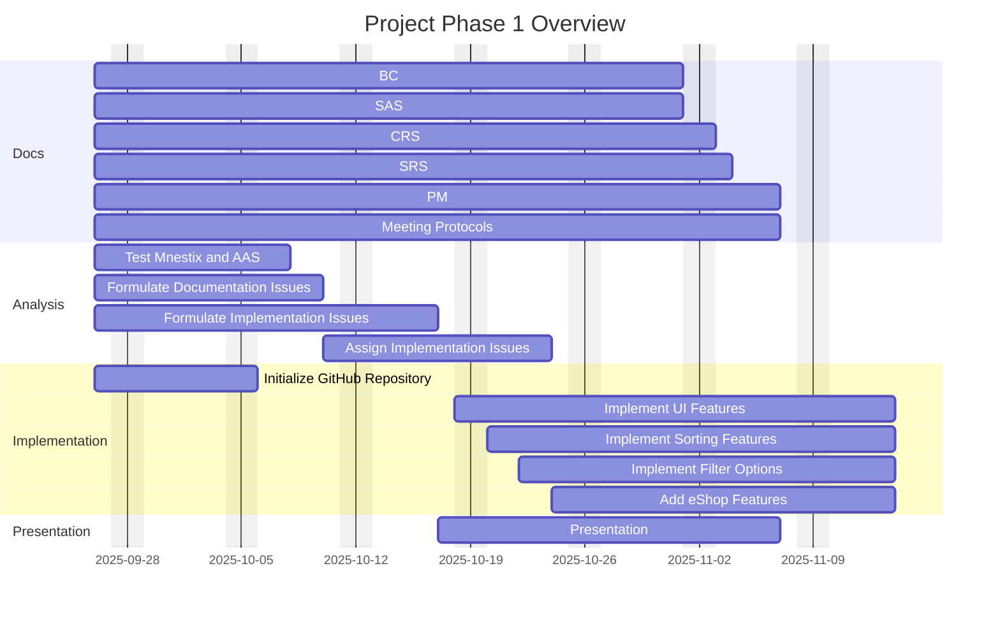
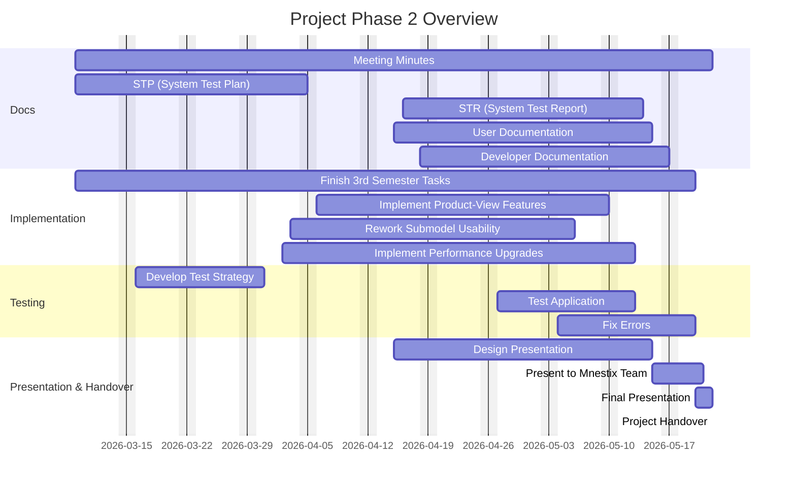

# LOOK AT WORD VERSION AGAIN
| Version | Date       | Author         | Comment                                      |
|:--------:|:-----------:|:---------------:|:---------------------------------------------|
| 1.0 | 09.10.2025 | Nils Schäffner | Initialize BC and document structure          |
| 1.1  | 10.10.2025 | Nils Schäffner | Formulate Introduction, Scope and Benefits |
| 1.2 | 12.10.2025 | Nils Schäffner | Initialzie BC as Markdown in GitHub Docs |
| 1.3 | 14.10.2025 | Nils Schäffner | Add Gantt diagram and cost calculation |

# TABLE OF CONTENTS
Intro
Was ist zu verbessern, implementieren
Warum ist das gut
GANTT
RISIKOMATRIX
Kostenrechnungen
Angebot

# Introduction
This document outlines the business case for the upcoming software project. The project team has successfully collaborated on multiple projects in the past, continuously developing strong web engineering expertise to deliver high-quality digital products.
In the following sections, the customer’s order will be presented in detail, with a particular focus on the value and benefits our solution will provide to the client. Furthermore, this document serves as the formal business proposal submitted to the customer. It includes a comprehensive time and risk analysis, followed by a detailed cost estimation required to successfully complete the project.

# Scope
Mnestix Product Catalogue is a web-based open-source software designed to simplify the implementation of the Asset Administration Shell (AAS). Its main purpose is to support the creation and management of digital product catalogues, offering various features for browsing and organizing catalogue data.
However, several important usability and functionality aspects are still missing from a user perspective. The planned improvements will mainly focus on enhancing the application’s usability and integrating additional services such as the Nameplate Generator. Furthermore, eShop functionalities (e.g., Add to Cart, Show Cart) will be introduced, and the presentation of documentation and technical data will be refined.
The project also aims to improve product search, filtering, and data visualization while ensuring smoother interaction with repositories. In addition, the team will analyze existing features, evaluate the current usability concept, and implement targeted improvements to increase overall efficiency and user satisfaction.
#For detailed requirements see CRS

# Qualitative and quantitative benefits of development

The enhancement of the Mnestix Product Catalogue brings measurable functional and economic value by improving usability, efficiency, and interoperability within the AAS ecosystem.

| Qualitative Benefits |
|:---------------------|
| Improved Usability and User Experience
A clearer interface, faster navigation, and better data presentation reduce user effort and increase acceptance. |
| Enhanced Integration and Interoperability
Stronger AAS standard compliance enables smoother interaction with external systems and future extensions. |
| Higher Customer Satisfaction
Added features such as the Nameplate Generator and eShop functionality expand the system’s usefulness and market appeal. |
| Knowledge and Community Value
The project strengthens the open-source Mnestix ecosystem and the team’s expertise in digital twin technologies. |

| Quantitative Benefits |
|:----------------------|
| Time Efficiency – Up to 30–40% faster product search and data operations through optimized loading and filtering. |
| Lower Maintenance Costs – A more modular and documented codebase reduces long-term effort by 20–25%. |
| Improved Data Quality – More consistent repository handling reduces input errors by around 15–20%. |
| Future Scalability – A unified architecture supports cost-effective integration of future modules and services. |

#### Business Impact
Overall, the development increases productivity, reduces operational costs, and strengthens Mnestix’s position as a modern, user-friendly platform for AAS-based product catalogue management.

